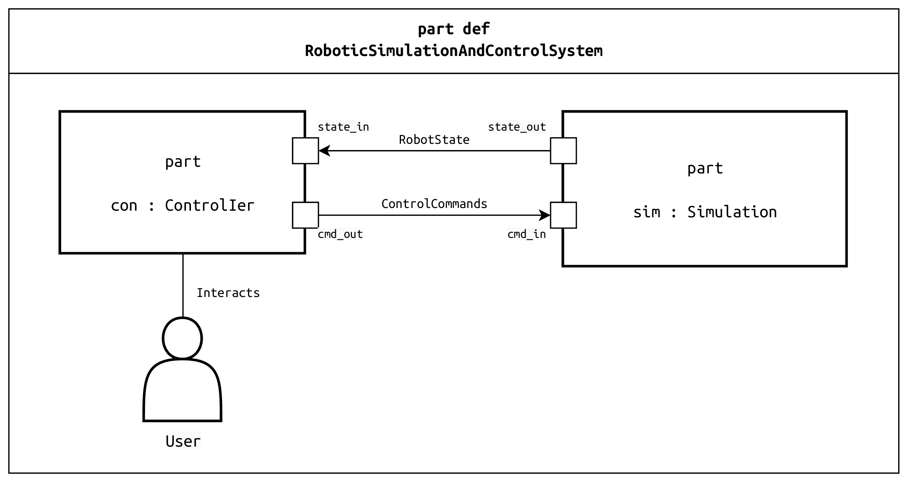

**Software engineering project for the**Software engineering project for the 25-26 course**


This is a README file for the SE25 project's GitHub repository. This README is designed to be the central entry point for any team member, providing all the necessary information to get started, understand the project's goals, and contribute effectively.


---


# SE25 – Robot Simulation and Control System


<!--  -->


This repository contains the source code and documentation for the **SE25 - Robot Simulation and Control System**, a project for the Project-Based Learning (PBL) course in Software Engineering.


The project involves the development of a real-time robotic simulation and control system, adhering to the ISO 12207 software life cycle processes and utilizing terminology from the IEEE Guide to the Software Engineering Body of Knowledge (SWEBOK).


## Core Technologies


- **Language:** C++ (using C++17 standard)

- **Middleware:** ROS 2 Jazzy Jalisco

- **RT & Concurrency:** POSIX (pthreads)

- **Build System:** CMake

- **Operating System:** Ubuntu 24.04 LTS

- **Version Control & PM:** Git & GitHub


## System of Interest (SoI) Overview


The System of Interest is a distributed system composed of two primary components: a **Simulation System** and a **Control Interface**. These components communicate in real-time to simulate a 6-axis robotic arm in a 3D environment and allow for its control through a user interface.


### System Architecture


The following SysML v2 diagram illustrates the high-level structure and the primary data flows of the system:





### Key Operational Scenarios


The system is designed to fulfill the following core operational scenarios:


1.  **System Initialization and Robot Loading:** The user launches the system, which loads a 3D model of a robotic arm into a virtual world and establishes a connection between the simulation and the control interface.

2.  **Manual Control:** The user manually controls the individual joints of the robotic arm in real-time via the control interface.

3.  **Automated Path Execution:** The user defines a sequence of target poses, and the system calculates and executes a smooth trajectory for the robot to follow.

4.  **Fault Detection and Response:** The system detects a collision in the simulation, immediately halts the robot's motion, and notifies the user.


## Project Structure


This repository is structured as a ROS 2 workspace. All custom packages are located within the `src` directory.


```
SE25/

├── doc/
│ ├── deliverable/
│ │ └── archives/
│ └── guide/
│ 
├── images/
├── models/
│ ├── Requisitos/
│ └── Reverse_model/
└── src/
  ├── ros2_control_demo_description/
  └── ros2_control_demo_example_7/
```

README for the structure of the branch. This repository contains the documentation, models, images, and source code for the SE25 project. The structure follows software engineering best practices to support maintainability, traceability, and collaborative work.


### 1. `doc` — Project Documentation


This directory contains all written documentation related to the project. It includes formal deliverables, internal guides, evaluation reports, and planning documents.


#### 1.1 `doc/deliverable` — Formal Deliverables

This folder contains documents that are formally delivered to stakeholders, instructors, or clients.  

Files follow the naming convention:  

`[DocumentType]_[ProjectCode]_[Version]_[YYYY-MM-DD].md`


Typical documents include:

- SRS — Software Requirements Specification  

- SDD — Software Design Document  

- Technology and tool evaluation reports  

- Other required deliverables for project milestones


#### 1.2 `doc/guide` — Internal Guides

This folder contains internal documents intended for the development team.  

These documents are not formal deliverables.


Examples:

- Code Style Guide  

- Change Management Plan  

- Software Development Plan  

- Reverse Engineering Guide  

- Simulation setup instructions for the 6-DOF robotic arm  

- Instructions for running the project in mixed Windows/Ubuntu environments


Purpose: to provide instructions and standards for development, configuration, and collaboration.


---


### 2. `images` — Image Assets


This directory contains images used throughout the documentation, such as:

- UML diagrams  

- Architecture diagrams  

- Simulation snapshots  

- Any other graphical assets referenced in Markdown documents


---


### 3. `models` — System Models

This directory contains all system modeling artifacts, typically produced with UML or similar methodologies.

#### 3.1 `models/Requisitos`

Contains requirement-related models, including:

- Use case diagrams  
- Activity diagrams  
- Conceptual models  
- Other functional analysis models  

#### 3.2 `models/Reverse_model`

Contains models generated through reverse engineering, such as:

- Class diagrams derived from source code  
- Dependency diagrams  
- Automatically generated structural representations  

The `README.md` within the `models` directory provides a detailed description of UML and SysML models, including their structure, purpose, and modeling approach used in the project.

---

### 4. `src` — Source Code

This directory contains the executable implementation of the project.

#### 4.1 `src/ros2_control_demo_description`

Contains ROS 2 code related to the minimal description and configuration of the robot for demos.  

Includes:

- Basic URDF/XACRO  
- Minimal `ros2_control` configuration  
- Simple controllers (e.g., position controllers)  
- Launch files for RViz and demo execution  

#### 4.2 `src/ros2_control_demo_example_7`

Contains example code for more advanced tests and simulations.  

Includes:

- More complex robot and controller configurations  
- Structured launch and visualization examples  
- Integration with simulated or real sensors  

The `README.md` inside `src` provides a detailed explanation of how the source code is organized, its relationship with UML/SysML models, and how generated, copied, and manually written code coexist.


## Development Environment Setup


To ensure a consistent development environment for all team members, please follow these setup instructions carefully on **Ubuntu 24.04 LTS**.


### 1. Install Core Dependencies


First, install Git, GCC compiler, and CMake.


```bash

sudo apt update

sudo apt install git build-essential cmake

```


---

### 2. Install ROS 2 Jazzy Jalisco


Follow the official ROS 2 documentation to install the **ROS 2 Jazzy Jalisco** `ros-desktop` version.


[Official ROS 2 Jazzy Installation Guide](https://docs.ros.org/en/jazzy/Installation.html)


The key installation command is:


```bash

sudo apt install ros-jazzy-desktop

```


After installation, remember to source the setup file in your shell:


```bash

echo "source /opt/ros/jazzy/setup.bash" >> ~/.bashrc

source ~/.bashrc

```


### 3. Clone and Build the Project


1.  **Create a Colcon Workspace:**

    ```bash

    mkdir -p ~/ros2_ws/src

    cd ~/ros2_ws/

    ```


2.  **Clone the Repository:**

    Clone this repository into your workspace's `src` directory.

    ```bash

    git clone https://github.com/your-username/se25-robot-control.git src/se25_robot_control

    ```


3.  **Install Dependencies and Build:**

    Use `rosdep` to install any package dependencies and `colcon` to build the workspace.

    ```bash

    rosdep install -i --from-path src --rosdistro jazzy -y

    colcon build

    ```


4.  **Source the Workspace:**

    Finally, source your local workspace's setup file. Add this to your `.bashrc` for convenience.

    ```bash

    echo "source ~/ros2_ws/install/setup.bash" >> ~/.bashrc

    source ~/.bashrc

    ```


## Usage


After successfully building the project, you can launch the full system using the provided ROS 2 launch file.


1.  Open a new terminal.

2.  Source your workspace: `source ~/ros2_ws/install/setup.bash`

3.  Launch the system:

    ```bash

    ros2 launch control_pkg full_system_launch.py

    ```

This launch file will:


* Load the robot model (`robot_initial` or `robot_extended`)

* Start the controllers

* Open RViz for visualization

* Start the GUI for manual control

* Launch all necessary ROS 2 nodes


---


### 4. Graphical User Interface (GUI)


The GUI allows direct interaction with the robot:


* **Joint sliders**: Control each degree of freedom of the 6-DOF robotic arm

* **Base slider** (robot_extended only): Translate the robot horizontally

* **Status panel**: Shows warnings, errors, and collision events

* **Path manager**: Load, define, and execute automated paths


All changes in the GUI are reflected in real time in RViz.


---


### 5. Manual Control


Manual control is the simplest mode of operation:


1. Ensure the robot is **enabled** in the GUI.

2. Move the sliders to set joint positions.

3. The robot updates in real time in the simulation.

4. Press **Reset** to return to the home position.


---


### 6. Automated Path Execution


The system can execute predefined trajectories automatically:


1. Open the **Path Manager** in the GUI.

2. Add one or more **poses** for the robot to reach.

3. Configure timing, interpolation type, and velocity limits.

4. Press **Execute Path** to run the trajectory.


The system will halt automatically in case of a collision or if **Emergency Stop** is pressed.


---


### 7. Useful ROS 2 Commands


Some commands can be used in the terminal for development and testing:


* Check joint states:


ros2 topic echo /joint_states


* Send a quick test command:


ros2 topic pub /joint_commands sensor_msgs/msg/JointState "{position: [0,0,0,0,0,0]}"


* List active controllers:


ros2 control list_controllers


* Switch controllers:


ros2 control switch_controller --start <controller_name>


---


### 8. Summary


1. Install prerequisites.

2. Clone and build the workspace.

3. Launch the system with the provided ROS 2 launch file.

4. Use the GUI to control the robot manually or execute automated trajectories.

5. Use ROS 2 commands to monitor and interact with the system if required.

## Project Management


This project is managed using **GitHub Issues** and **GitHub Projects**. This keeps our tasks, discussions, and code all in one place.


-   **[Issues Tab](https://github.com/MII-IS/SE25/issues):** All requirements, tasks, bugs, and feature requests are tracked as issues.

-   **[Project Board](https://github.com/orgs/MII-IS/projects/1):** A Kanban-style board is used to visualize the workflow and track the status of each issue. The columns are: `Backlog`, `To Do`, `In Progress`, `In Review`, `Done`.


## Contribution Workflow


All code contributions must be made through **Pull Requests (PRs)** to ensure code quality and maintain a stable `develop` branch.


1.  **Create/Assign an Issue:** Before starting work, make sure there is an issue that describes the task. Assign it to yourself.

2.  **Create a Feature Branch:** Create a new branch from the `develop` branch. Name it according to the feature or issue (e.g., `feature/REQ-FUN-006-path-execution`).

3.  **Implement and Test:** Write your code and include necessary unit tests. Ensure all tests pass locally.

4.  **Submit a Pull Request:** Push your branch to GitHub and open a pull request to merge it into the `develop` branch. Link the PR to the issue it resolves.

5.  **Request a Review:** Assign at least one other team member to review your code. Discuss any feedback and make necessary changes.

6.  **Merge:** Once the PR is approved and all checks have passed, it can be merged into `develop`.


## License


This project has no license.


## Team Members


| Role | Name | GitHub Handle |

| :--- | :--- | :--- |

| Project Manager | Ricardo Sanz | @rsanz |

| System Architect | Ricardo Sanz | @rsanz |

| Requirements Lead | Javier Pulido | @Pulido1822 |

| Design Lead | Pablo Fraile | @PabloFraile |

| Implementation Lead | Adela Zapatera | @adelazapatera |

| Integration Lead | Victor Rodríguez | @Victor23RR |

| QA Lead | Daniel D'Alascio | @danieldalascio |

| Documentation Manager | Elisa Oyaregui | @elisa109 |

| Configuration Manager | Rodrigo Condato | @rodrigocondado |


---
